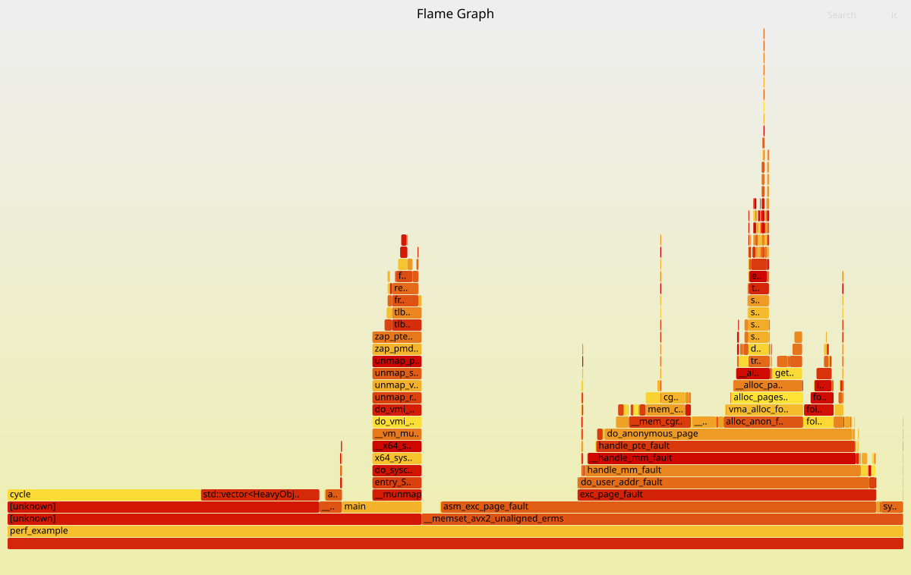
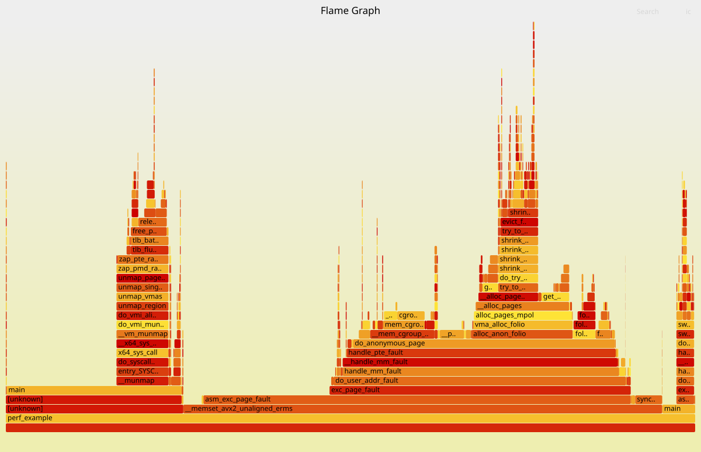

flamegraph до рефакторинга:



Запуск утилиты для рефакторинга добавил `&` к переменной в цикле:

```
/tmp/clang-refactor-tool/tests/tests_data/perf_example.cpp:10:21: remark: Объявлена переменная
   10 |     for (const auto obj : vec) {  // Копирование без &
      |                     ^
```



После рефакторинга компилятор смог оптимизировать вызов cycle, и, похоже, в данном случае вовсе удалил почти весь код.
